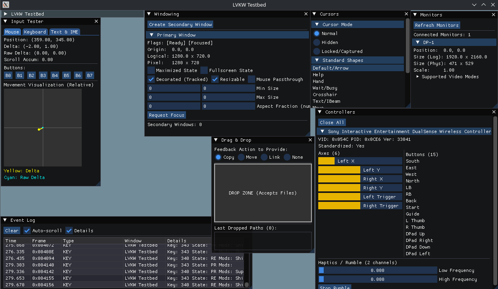

# LVKW

[](https://github.com/birdsafe/lvkw/actions/workflows/build.yml)
[](LICENSE.md)

LVKW is a Platform Abstraction Layer for Vulkan-centric applications and games.

What sets it apart from the rest:
- Absolutely 0 global state. Completely inert when not actively used.
- Extremely fast and robust direct-dispatch event processing.
- No-overhead first-class-citizen C++ API.
- API use is aggressively validated in debug, and all guardrails can be disabled for maximum performance.
- Optional recoverable API for CFFI integrations.

It does two things and attempts to do them as well as it can: Reliably provide you with a rendering surface and as much robust OS support as possible with as light of a footprint (both time and space) as I can squeeze it in.

## Status

Ready for use by early adopters on Linux.

### Backend completion matrix (rough)

| Module | Wayland | X11 | Win32 | Cocoa |
| :--- | :---: | :---: | :---: | :---: |
| `core` | 100% | 100% | 0% | 100% |
| `context` | [100%*](docs/user_guide/backend_limitations.md#wayland-module-context) | [100%*](docs/user_guide/backend_limitations.md#x11-module-context) | 0% | [70%](docs/user_guide/backend_limitations.md#cocoa-module-context) |
| `display` | [90%](docs/user_guide/backend_limitations.md#wayland-module-display) | [80%](docs/user_guide/backend_limitations.md#x11-module-display) | 0% | [50%](docs/user_guide/backend_limitations.md#cocoa-module-display) |
| `events` | [90%](docs/user_guide/backend_limitations.md#wayland-module-events) | [80%](docs/user_guide/backend_limitations.md#x11-module-events) | 0% | [50%](docs/user_guide/backend_limitations.md#cocoa-module-events) |
| `input` | [90%](docs/user_guide/backend_limitations.md#wayland-module-events) | [80%](docs/user_guide/backend_limitations.md#x11-module-events) | 0% | [80%](docs/user_guide/backend_limitations.md#cocoa-module-events) |
| `data` | [80%](docs/user_guide/backend_limitations.md#wayland-module-data) | [80%](docs/user_guide/backend_limitations.md#x11-module-data) | 0% | [0%](docs/user_guide/backend_limitations.md#cocoa-module-data) |
| `instrumentation` | 100% | 100% | 0% | [70%](docs/user_guide/backend_limitations.md#cocoa-module-context) |
| `shortcuts` | [90%](docs/user_guide/backend_limitations.md#wayland-module-display) | [80%](docs/user_guide/backend_limitations.md#x11-module-display) | 0% | [60%](docs/user_guide/backend_limitations.md#cocoa-module-display) |
| `ext/controller` | [70%](docs/user_guide/backend_limitations.md#wayland-module-ext-controllers) | [70%](docs/user_guide/backend_limitations.md#x11-module-ext-controllers) | 0% | [0%](docs/user_guide/backend_limitations.md#cocoa-module-ext-controllers) |

\* Means there are limitations, but they are intentional. Follow links for the details.

## Quickstart 

Run the following, and you should be presented with a ImGui-based playground to mess with the various things LVKW provides.

You first need need: 
  - [git](https://git-scm.com/)
  - [CMake](https://cmake.org/) (3.20 or above)
  - The [Vulkan SDK](https://vulkan.lunarg.com/sdk/home).

```bash 
# Linux/macOS: you may or may not have to do this depending on your environment.
# source path/to/vulkan/sdk/setup-env.sh

git clone https://github.com/birdsafe/lvkw
cd lvkw
cmake -S . -B build
cmake --build build --config Release
# On macOS/Linux
./build/tools/testbed/lvkw_testbed
# On Windows
#./build/tools/testbed/Release/lvkw_testbed
```


**N.B.** The ImGUI window arrangement will probably be different.

## Integration

The easiest way to integrate LVKW is via CMake (`FetchContent` or `add_subdirectory`).

```cmake
add_subdirectory(path/to/lvkw)
target_link_libraries(your_target PRIVATE lvkw::lvkw)
```

or

```cmake
include(FetchContent)
FetchContent_Declare(lvkw
  GIT_REPOSITORY https://github.com/birdsafe/lvkw.git
  GIT_TAG <target_version>
)
FetchContent_MakeAvailable(lvkw)
target_link_libraries(your_target PRIVATE lvkw::lvkw)
```


## Example

Here's a sample in C++-20. Check out the complete [C example](examples/basic_c/main.c) if that's more your thing. It's materially the same.

```cpp
// N.B. lvkw does not include vulkan headers for you. It does not care if you include them before or after it, and it doesn't require any #define beforehand.
#include <vulkan/vulkan.h>
#include "lvkw/lvkw.hpp"

int main() {
  bool keep_going = true;
  MyRenderEngine engine;

  // 1. Create a dispatcher with your event handlers.
  // This uses C++20 concepts and lambdas for a clean, type-safe API.
  auto dispatcher = lvkw::makeDispatcher(
    [&](lvkw::WindowReadyEvent evt) {
      // Window is ready, get a surface and initialize your engine with it
      // Note: evt.window gives you access to the window handle
      auto surface = evt.window->createVkSurface(vk_instance);
      engine.init(surface);
    },
    [&](lvkw::WindowCloseEvent) { keep_going = false; },
    [&](lvkw::KeyboardEvent evt) { /*...*/ },
    [&](lvkw::MouseMotionEvent evt) { /*...*/ }
  );

  // 2. Create a lvkw context, registering your dispatcher.
  LVKW_ContextCreateInfo ctx_info = LVKW_CONTEXT_CREATE_INFO_DEFAULT;
  ctx_info.attributes.event_callback = decltype(dispatcher)::callback;
  ctx_info.attributes.event_userdata = &dispatcher;
  lvkw::Context ctx(ctx_info);

  // 3. Initialize your VkInstance with the extensions lvkw needs
  auto extensions = ctx.getVkExtensions();
  VkInstance vk_instance = /* ... */;

  // 4. Create a lvkw window
  LVKW_WindowCreateInfo window_info = {
      .attributes = {
        .title = "LVKW Example",
        .logical_size = {800, 600}
      },
      .app_id = "example.lvkw",
  };

  lvkw::Window window = ctx.createWindow(window_info);

  // 5. Main Loop
  while (keep_going) {
    // pumpEvents triggers the processing of OS events, 
    // which are dispatched directly to your handlers.
    ctx.pumpEvents(0);

    if (engine.ready()) {
      // draw stuff
    }
  }

  return 0;
}
```

Consult the `examples/` directory for more, including the pure C equivalent of this in `examples/basic_c`

## System requirements:
- Using LVKW requires
  - A compiler supporting C11 or C++11 (C++20 adds a few goodies)
  - LVKW doesn't have any other dependencies itself, but your app will need Vulkan headers and a Vulkan loader to do anything interesting with it.

- Compiling the library requires: 
  - A C11 compiler.
  - CMake (3.20 or above)
  - On macOS:
    - The following frameworks: Cocoa, QuartzCore and Metal
  - On Linux:
    - POSIX headers
  - On Windows:
    - (TBD, but almost certainly nothing that doesn't come pre-packaged with MSVC)
  - Examples and tools also require the Vulkan SDK to be installed and findable.


## Safety, Validation and diagnostics

LVKW provides a few different options to control the validation behavior. These are all fixed at the time of compiling the library.

* **LVKW_VALIDATE_API_CALLS**: `OFF` by default. Setting it to `ON` will activate VERY aggressive validation of the API use. This includes thread affinity checks, state validation, the works.

* **LVKW_RECOVERABLE_API_CALLS**: `OFF` by default. Setting it to `ON` will make invalid API calls return early with an error status instead of intentionally aborting. This is mainly useful for FFI/script-driven integrations.

* **LVKW_ENABLE_DIAGNOSTICS**: `ON` by default. Setting it to `OFF` will strip virtually all logging and reporting overhead from the library, including the string literals.

* **LVKW_GATHER_METRICS**: `ON` by default. Setting it to `OFF` it will stop the gathering of internal metrics.

* **LVKW_ENABLE_INTERNAL_CHECKS**: `OFF` by default. Setting it to `ON` will enable a lot of internal validation logic. (Only use this if you suspect a bug in LVKW itself).

#### Recommended configurations

| Build Type | `LVKW_VALIDATE_API_CALLS` | `LVKW_RECOVERABLE_API_CALLS` | `LVKW_ENABLE_DIAGNOSTICS` | `LVKW_GATHER_METRICS` | `LVKW_ENABLE_INTERNAL_CHECKS` |
| :--- | :---: | :---: | :---: | :---: | :---: |
| **Development** | `ON` | `OFF` | `ON` | `ON` | `OFF` |
| **Release** | `OFF` | `OFF` | `ON` | `ON` | `OFF` |
| **Production** | `OFF` | `OFF` | `OFF` | `OFF` | `OFF` |
| **Debugging lvkw** | `ON` | `OFF` | `ON` | `ON` | `ON` |
| **FFI hardening** | `ON` | `ON` | `ON` | `ON` | `OFF` |

**N.B.** `LVKW_ENABLE_INTERNAL_CHECKS` can have subtle implications beyond performance in some cases. See [Internal Checks Caveats](docs/dev_guide/internal_checks_caveats.md) for details.

## Documentation

The public headers and root CMakeLists.txt are meant to contain nothing but user-relevant information. As such, they can serve as reference guides in and of themselves.

- C API: [`include/lvkw/lvkw.h`](include/lvkw/lvkw.h) and first-level headers under [`include/lvkw/c/`](include/lvkw/c/)
- C++ API: [`include/lvkw/lvkw.hpp`](include/lvkw/lvkw.hpp) and first-level headers under [`include/lvkw/cpp/`](include/lvkw/cpp/)
- Root [`CMakeLists.txt`](CMakeLists.txt)

The [User Guide](docs/user_guide/index.md) is not meant to be a full guide, but rather a collection of deep-dives on technical nitty-gritty that might be of interest to advanced users. We expect that the headers and examples should be all the documentation you need to get started.

## FAQs

### Is LVKW Thread-safe?

Here's a quick overview of the thread-safety LVKW provides.

#### Context Isolation

Each context is its own universe; different contexts can live on different threads without interfering with each other.

#### Direct Dispatch

All OS-level event processing (triggered by `pumpEvents`) is strictly performed on the **primary thread** (the one that created the context). Your registered event callback will always be executed on that thread as part of the `pumpEvents` call.

#### Concurrent Event Posting

While event processing is restricted to the primary thread, you can safely post user-defined events from any thread using **`lvkw_events_post`**. These events are internally queued and then dispatched on the primary thread during the next `pumpEvents` call.

**N.B.** The `pumpEvents` call dispatches events directly to your handlers. No internal double-buffering or manual scan phase is required.

### Does LVKW use X11 or Wayland on Linux?

Yes!

You use either or both. The default is a one-size-fits-all mode that will try Wayland first and fall back to X11 if it cannot use it, but you can force it one way or another at runtime. Every system dependency is manually loaded and checked, so your app will work as long as either X11 or Wayland is available.

If you want to exclusively support X11 or Wayland, that's also possible, and it eliminates every shred of overhead from the dynamic selection machinery (what little there is). See the [Integration guide](docs/user_guide/integration.md) for details.

### Can I use lvkw for other rendering APIs (OpenGL, DX11/12, etc...)?

Not at the moment. Maybe one day, as an extension, but OpenGL would almost certainly have to break some of the guarantees that we are currently providing.

### How does LVKW handle high-frequency mouse input?

LVKW coalesces redundant events as much as it can. This prevents high-polling-rate mice from overwhelming your application with redundant updates while maintaining sub-pixel precision. And before you ask: Yes, it does so without breaking temporal ordering with key and button events.

See the [Event System & Input Deep Dive](docs/user_guide/events_and_input.md) for more details.

### Does LVKW initialize Vulkan for me?

Nope. There are too many decisions to make around that. The library has a mandate: deal with windows and I/O, and it sticks to it. It does a grand total of 2 Vulkan-specific things:

1 - Get which extensions you need to provide `vkCreateInstance()` via `lvkw_display_listVkExtensions()`
2 - Create a `vkSurfaceKHR` for a given window (which you are responsible for deleting) via `lvkw_display_createVkSurface()`

### Is there really no synchronous window creation mechanism?

"You'll thank me later." is a crass way to put it, but that's effectively our stance on this.

Unfortunately, asynchronous window creation is absolutely necessary to get a smooth experience in certain backends. On top of that, synchronous window creation is too sticky/tempting of an API, so it's easy to paint oneself in a corner and run into issues later down the road.

### What's up with the attribute substructs in the createInfos? What goes in them seems arbitrary.

Some properties of context/windows must be set at creation, and others can be changed on the fly later. Attributes represent the later, and the same struct type is used when populating the create infos and when invoking `lvkw_context_update()` / `lvkw_display_updateWindow()`. That makes things nice and consistent.

### Can I store event pointers for later?

**No.** The `LVKW_Event*` pointer passed to your callback is only valid for the duration of that callback. Many event payloads also contain pointers (marked as `LVKW_TRANSIENT` in headers) that are also only valid for the duration of the callback.

If you need to store event data for later processing, you must copy the underlying data (e.g., `memcpy` the structure or `strdup` strings).

### What's the difference between logical vectors and pixel vectors

The wording distinction is to make dealing with High DPI (retina) displays easier.

All coordinate variables and types have either `logical` or `pixel` in their name to make crystal clear if they are referring to logical OS dimensions or to the actual pixel count. In short, use `logical` units for your UI and `pixel` for rendering.

### What's up with LVKW_HOT and LVKW_COLD?

The library is built with the assumption that certain API functions might be called every frame (HOT), and others will not (COLD). If you are calling an `LVKW_COLD` method every frame, you are not using the library the way we expect. That's all there is to it. That does not mean COLD functions are necessarily heavyweight. It's just how we expect them to be used.

See the [Tuning & Performance Guide](docs/user_guide/tuning.md) for more information.

### Do I really need CMake to build the library itself? Can I just compile the files myself and use the headers?

Not reliably. Even if it was reasonably feasible today, it might break with any release. The CMake path is the only one we plan on ensuring stability on.

## Acknowledgements

While there has been a lot of divergence since, a lot of the design and code was originally inspired by, if not at times lifted from, the outstanding [GLFW](https://glfw.org). At the time of writing, credit goes to Marcus Geelnard (2002-2006) and Camilla Löwy (2006-2019)

The examples' code are derived from [Vulkan Tutorial](https://github.com/Overv/VulkanTutorial), but with modifications.

## License

LVKW is licensed under the Zlib license. See [LICENSE.md](LICENSE.md) for details.
